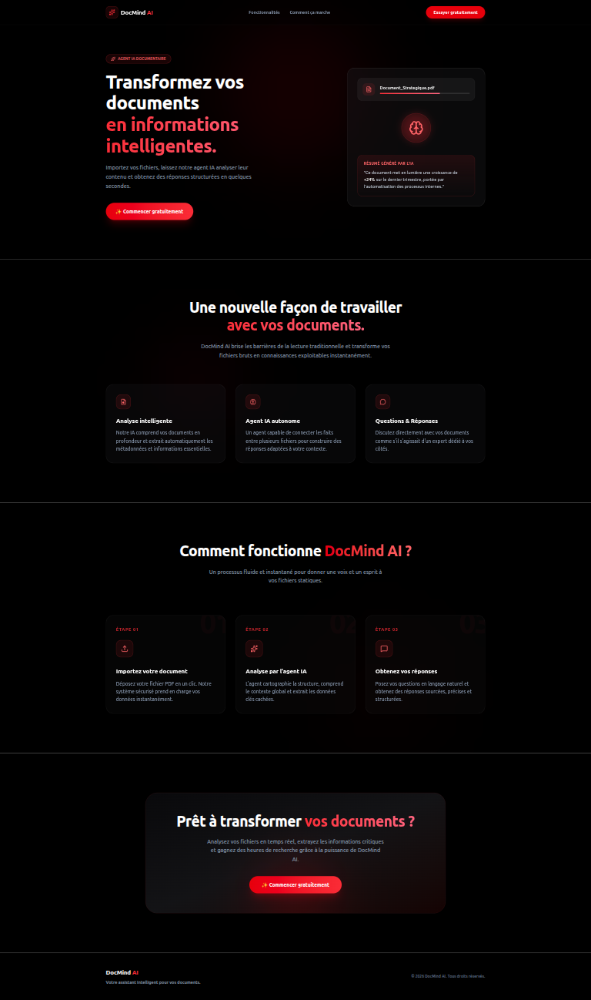

# 🧠 DocMind AI

AI-powered document assistant that helps users analyze, summarize and interact with their documents.

## 📸 Preview

---

## ✨ Features

- Modern SaaS Landing Page
- Responsive Design
- Clean UI/UX
- Built with React & Tailwind CSS
- Ready for AI document analysis integration

---

## 🛠 Tech Stack

- React
- Vite
- Tailwind CSS
- Lucide React
- Framer Motion

---

## 🚀 Roadmap

- [x] Landing Page
- [ ] AI Application Interface
- [ ] PDF Upload
- [ ] Document Text Extraction
- [ ] Document Agent
- [ ] Groq AI Integration
- [ ] Question & Answer
- [ ] Deployment

---

## 📄 License

This project is created for learning and portfolio purposes.